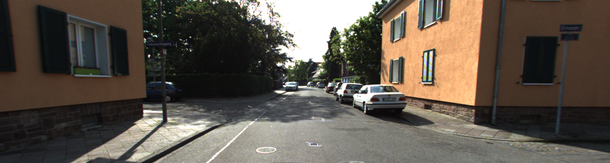
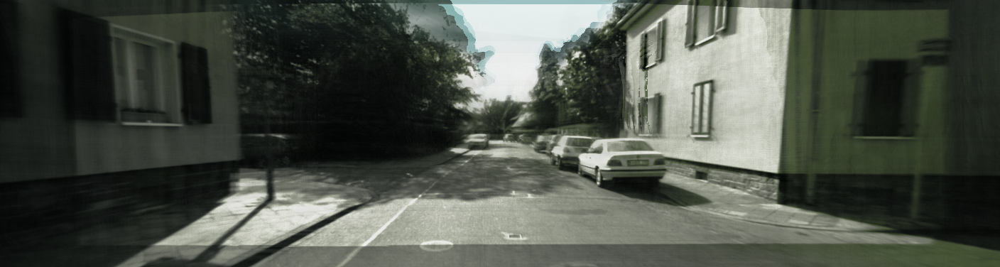
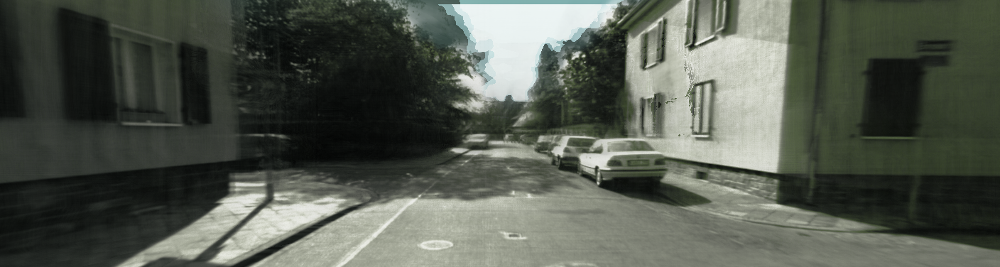
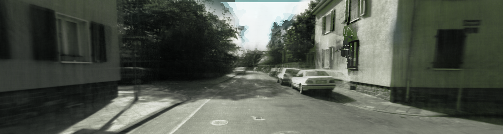

# EDUS Replication

## 1. Overview

This project is a from-scratch Python replication of:

> Sheng Miao, Jiaxin Huang, Dongfeng Bai, Weichao Qiu, Bingbing Liu, Andreas Geiger, and Yiyi Liao, **"Efficient Depth-Guided Urban View Synthesis,"** ECCV, 2024.
>
> [Project Page](https://xdimlab.github.io/EDUS/) · [arXiv:2407.12395](https://arxiv.org/abs/2407.12395)

The paper targets *generalizable* (feed-forward, no per-scene test-time optimization required) novel view synthesis for unbounded street scenes from sparse camera views, using depth-guided geometry as a prior instead of relying purely on photometric optimization. It decomposes a scene into three composited fields — a **foreground** field (a 3D SPADE-CNN voxel grid, built by accumulating multi-view stereo depth into a point cloud, combined with 2D image-based color retrieval from nearby reference views), a **background** field (image-based, using mip-NeRF-360-style scene contraction for everything outside the bounded foreground volume), and a **sky** field (a view-dependent environment map) — then volume-renders all three together.

This repo reimplements that pipeline stage by stage — KITTI-360 preprocessing (pose normalization, multi-view depth-consistency filtering, point-cloud accumulation, voxelization), the SPADE-CNN encoder, the foreground/background/sky decoders, hierarchical ray sampling, the volume-rendering composite, and the training losses — directly following the paper's section structure, and adds a training loop and a feed-forward validation CLI to fit and score it against the authors' own released KITTI-360 test scenes.

No official source release accompanies the paper (only a partially-compiled reference datamanager was available), so where the text was ambiguous, this reproduction verified its choices directly against the authors' released [`EDUS_inferdata`](https://xdimlab.github.io/EDUS/) validation scenes (poses, AABB bounds, voxel grids) rather than guessing — see [§5](#5-known-deviations--limitations) for where that surfaced real discrepancies worth knowing about.

## 2. How to use the code

### 2.1 Data preparation

Raw KITTI-360 data (images, poses, calibration, semantic labels) is not included in this repo — download it yourself from the [KITTI-360 site](https://www.cvlibs.net/datasets/kitti-360/) into a `raw-data/` folder laid out as `preprocess/kitti360.py` expects (`raw-data/KITTI-360/data_2d_raw/...`, `raw-data/data_poses/...`, `raw-data/calibration/...`, `raw-data/data_2d_semantics*/...`). `download_2d_perspective_curl.sh` fetches the perspective image zips for the three training drives used here (edit `train_list` for your own drive selection).

Stereo depth uses [RAFT-Stereo](https://github.com/princeton-vl/RAFT-Stereo) — clone it to `third_party/RAFT-Stereo` (with its `middlebury` checkpoint) before running the depth step.

With raw data and RAFT-Stereo in place, build the training corpus:

```
python -m preprocess.select_windows      # picks 80 non-overlapping 40-frame windows -> data_train/windows.json
python -m preprocess.make_dataset        # copies RGB + builds transforms.json + sky masks per window
python -m preprocess.raft_stereo_depth   # stereo depth maps per window
python -m preprocess.accumulate          # depth-consistency filtering + box-local point cloud -> frames.json
python -m preprocess.voxelize            # point cloud -> (128,64,256,3) RGB voxel grid
```

For validation (§2.3), download the authors' released [`EDUS_inferdata`](https://xdimlab.github.io/EDUS/) (5 KITTI-360 test scenes with precomputed Drop50/80/90 voxel grids) into `EDUS_inferdata/` — not included in this repo either.

### 2.2 Training

Trains the foreground + background + sky networks end-to-end via the composited volume-rendering loss (Sec. 4: RGB + sky BCE + foreground-opacity entropy — the LiDAR term is omitted, see [§5](#5-known-deviations--limitations)), with Input Volume Random Masking (App B.1) applied every step, periodic full-image preview renders, and checkpointing:

```
python -m training.train [--n-steps N] [--rays-per-batch N] [--resume PATH] ...
```

| Flag                | Default      | Meaning                                                                                          |
| ------------------- | ------------ | -------------------------------------------------------------------------------------------------- |
| `--n-steps`          | `10000`      | Steps to run **this invocation** (added on top of `--resume`'s step count, not an absolute target). |
| `--rays-per-batch`   | `4096`       | Rays sampled per training step (one random image + N random pixels, matching the paper's recipe). |
| `--lr`               | `5e-3`       | Adam learning rate (paper's initial rate; no decay schedule is given in the text, so none is used). |
| `--log-every`        | `500`        | Steps between console loss logs.                                                                  |
| `--ckpt-every`       | `1000`       | Steps between checkpoint saves (`checkpoint/step_<step>.pt`).                                      |
| `--render-every`     | `500`        | Steps between full-image preview renders of a random held-out eval frame (`renders/`).             |
| `--resume`           | *(none)*     | Checkpoint path to continue training from (restores weights, optimizer state, step count, and cumulative elapsed training time). |
| `--device`            | `cuda` if available, else `cpu` |                                                                          |

Example (continuing training 10,000 steps further):

```
python -m training.train --n-steps 10000 --resume checkpoint/step_10000.pt
```

### 2.3 Validation

Loads a checkpoint and evaluates **feed-forward only** (no per-scene fine-tuning / test-time optimization) on the 5 real released `EDUS_inferdata` scenes — never seen during training — at Drop50/80/90 reference sparsity, reporting PSNR/SSIM/LPIPS in the paper's Table 1 format:

```
python -m training.validate --checkpoint PATH [--drop-rates 50 80 90] [--max-eval-frames N] ...
```

| Flag                | Default                  | Meaning                                                                                               |
| -------------------- | ------------------------- | ------------------------------------------------------------------------------------------------------- |
| `--checkpoint`       | `checkpoint/final.pt`     | Checkpoint to evaluate.                                                                                |
| `--device`            | `cuda` if available, else `cpu` |                                                                                                    |
| `--drop-rates`       | `50 80 90`                | Which sparsity levels to evaluate (App D.2 strides: every 2nd/5th/10th frame kept as reference).       |
| `--max-eval-frames`  | *(all 16)*                 | Evenly subsample each scene's held-out eval frames down to this many per drop rate, to trade statistical depth for wall-clock time (full-image rendering is expensive — see §3). |

Example:

```
python -m training.validate --checkpoint checkpoint/final.pt --max-eval-frames 7
```

## 3. Results

**Training budget.** The paper trains for **500,000 steps** on one RTX4090 (~2 days). This reproduction trained for **20,000 steps** (~4% of that budget, ~29.7 hours) — this from-scratch implementation runs at roughly **15x slower per step** than the paper's reported rate (lacking `tinycudann`'s fused CUDA kernels and mixed precision, which the original implementation relies on but this pure-PyTorch reproduction doesn't reimplement), so matching 500k steps at this speed would take on the order of a month of continuous training. The metrics below should be read with that gap in mind — debugging throughout this project (structure/geometry renders correctly, isolated bugs fixed cleanly, and the remaining color error traced to desaturation/under-confidence rather than a wrong signal) points to undertraining as the dominant cause of the gap to the paper's numbers, not a fundamental pipeline error.

Feed-forward validation on the 5 real `EDUS_inferdata` test scenes (`checkpoint/final.pt`, step 19999; 7 evenly-subsampled eval frames/scene/drop-rate, 35 frames per row), compared against the paper's own Table 1 "No per-scene opt." row for the same KITTI-360 setting:

| Drop Rate | PSNR ↑ (Ours) | PSNR ↑ (Paper) | SSIM ↑ (Ours) | SSIM ↑ (Paper) | LPIPS ↓ (Ours) | LPIPS ↓ (Paper) |
| --------- | -------------: | --------------: | -------------: | --------------: | ---------------: | ----------------: |
| 50%       | 16.47          | 21.93            | 0.627          | 0.745            | 0.473             | 0.178              |
| 80%       | 16.19          | 19.63            | 0.601          | 0.668            | 0.496             | 0.244              |
| 90%       | 14.50          | —¹               | 0.546          | —¹               | 0.582             | —¹                 |

¹ The paper's own Table 1 (the feed-forward comparison this reproduction matches methodologically) only reports Drop50/80 — Drop90 only appears in a *different* table (Table 2, comparing against test-time-optimization baselines) where the paper's "Ours" numbers are *after per-scene fine-tuning* (19.16 / 0.657 / 0.271), so they aren't directly comparable to this reproduction's feed-forward-only Drop90 result and are omitted here rather than compared apples-to-oranges. This reproduction deliberately does not implement per-scene fine-tuning at all (feed-forward inference only).

Renders of the same held-out validation frame (`seq_00`, fid `7861`, `EDUS_inferdata`, never seen during training) across all three sparsity levels, generated via `training.validate`'s `render_scene_frame`:

| Ground Truth | Drop50 | Drop80 | Drop90 |
| :---: | :---: | :---: | :---: |
|  |  |  |  |

Geometry/structure (road, parked cars, building silhouettes, tree layout) reconstructs correctly at all three sparsity levels; the visible gap from ground truth is a color desaturation (muted rather than mis-hued output) on this scene's building material, consistent with an undertrained network hedging toward a bland average under uncertainty rather than a coordinate or retrieval bug — see [§5](#5-known-deviations--limitations) for how that was isolated.

## 4. Project structure

Each preprocessing and model file corresponds to one part of the paper's pipeline:

| File                                | Paper section it replicates                                                                                                                                     |
| ------------------------------------ | ------------------------------------------------------------------------------------------------------------------------------------------------------------- |
| `preprocess/kitti360.py`             | Raw KITTI-360 access: calibration, poses, frame availability.                                                                                                   |
| `preprocess/select_windows.py`       | The 80-scene generalizable training corpus (Sec. 5, "Dataset") — non-overlapping 40-frame windows.                                                              |
| `preprocess/normalize.py`            | Per-window pose normalization (trajectory-centered, middle-frame-anchored) underlying the AABB frame Sec. 5 describes.                                          |
| `preprocess/raft_stereo_depth.py`, `preprocess/stereo_depth.py` | Stereo depth input (Sec. 5, "Depth") — RAFT-Stereo (used) and an earlier OpenCV SGBM pass (kept for reference).                             |
| `preprocess/accumulate.py`           | Multi-view depth-consistency filtering + box-local point-cloud accumulation (Sec. 3.1 / App B.3).                                                                |
| `preprocess/voxelize.py`             | Point cloud → `(128,64,256,3)` RGB voxel grid, the foreground field's raw input.                                                                                 |
| `preprocess/make_dataset.py`         | Per-window RGB + camera poses + sky masks, laid out to match the released `EDUS_inferdata` format.                                                               |
| `training/model/spade_encoder.py`    | Sec. 3.1 — the foreground field's 3D SPADE-CNN feature-volume encoder.                                                                                           |
| `training/model/foreground.py`       | Sec. 3.1, Eq. 1-2 — trilinear feature sampling from the voxel grid and the density decoder.                                                                      |
| `training/model/color.py`            | Sec. 3.1, Table 4 (App A.2) — the foreground color decoder: 2D image-based retrieval from nearby reference views + per-image appearance embedding.               |
| `training/model/background.py`       | Sec. 3.2, Table 5 (App A.3) — the background field (mip-NeRF-360 scene contraction, image-based).                                                                |
| `training/model/sky.py`              | Sec. 3.2, "Sky Modelling", Table 5 (App A.3) — the sky field (view-dependent environment map).                                                                    |
| `training/model/sampling.py`         | App B.2 — hierarchical ray sampling (uniform + disparity + iterative importance resampling).                                                                     |
| `training/model/render.py`           | Sec. 3.3, Eq. 5-6 — the compositional volume-rendering integral across foreground, background, and sky.                                                          |
| `training/model/losses.py`           | Sec. 4, Eq. 8-12 — the training loss (RGB + sky BCE + entropy regularization; the LiDAR term is omitted, see [§5](#5-known-deviations--limitations)).             |
| `training/model/masking.py`          | App B.1 — Input Volume Random Masking.                                                                                                                            |

Files that support training, validation, and inference; they don't map to one specific paper section:

| File                                   | Purpose                                                                                       |
| ---------------------------------------- | ----------------------------------------------------------------------------------------------- |
| `training/model/model.py`                | `EdusModel` — ties the encoder/foreground/background/sky modules and sampling into one forward pass. |
| `training/dataset.py`                    | Training-time PyTorch `Dataset`: random ray batches from a window's held-out eval frames + its voxel grid. |
| `training/render_utils.py`               | Chunked full-image rendering (all pixels of one frame), used for training previews and evaluation. |
| `training/train.py`, `training/validate.py` | The training and feed-forward validation CLIs described in [§2](#2-how-to-use-the-code) above. |
| `tools/`                                 | Point cloud / voxel grid / depth-map visualization utilities used during development.             |

## 5. Known deviations & limitations

No official source release accompanies this paper, so several choices below were resolved by direct inspection of the authors' released `EDUS_inferdata` (poses, AABB bounds, voxel grids) rather than the paper text alone, and are recorded here rather than left silent:

- **LiDAR supervision is omitted entirely.** The paper's training loss includes an optional LiDAR line-of-sight term (λ₁=0.1); this reproduction uses only the paper's own "fine-tuning" loss formula (RGB + sky + entropy, no LiDAR term) throughout, since LiDAR integration was out of scope for this reproduction.
- **Held-out evaluation frames use a different pattern than the paper's literal Drop50.** Frames are split into a stride-5 reference set (App B.3) and a mod-10 `{1,3,7,9}` held-out set (reusing the paper's own App D.1 test-frame pattern) rather than the paper's Drop50 stride-2 choice, specifically because Drop50 shares a residue with the stride-5 reference set (frames 0/10/20/30 would be both reference and supervision target) — the pattern used here has zero overlap with the reference set at every drop rate.
- **Eval frames whose camera pose sits at or near the foreground AABB boundary are filtered out of training** (`training/dataset.py`, 2m clearance margin) — measured across all 1280 candidate eval frames, 18% sit fully outside the box and this rises only modestly to 22.6% at a 2m margin, concentrated almost entirely in the temporal boundary frames of each 40-frame window (camera drifting past the box edge), not a general issue.
- **The released `EDUS_inferdata` sky masks use the opposite polarity from this project's own preprocessing** (`0`=sky there vs. `255`=sky here) — confirmed by direct inspection (zero-pixels trace the sky silhouette exactly) and corrected for in `training/validate.py`; anyone reusing that released data with code that assumes one fixed convention should double check this.
- **No `tinycudann` / mixed precision** — this is a plain-PyTorch reproduction (the SPADE encoder's fused CUDA kernels are reimplemented as ordinary PyTorch ops), which measures roughly 15x slower per training step than the paper's reported rate; see [§3](#3-results).
- **Unseen-scene appearance embedding uses the mean of all trained per-image codes** (App A.2's average-embedding case), since validation scenes have no trained embedding of their own — confirmed empirically to behave the same as any individual trained embedding row on these scenes, so it isn't a source of the color gap noted in §3.

## 6. Citations

This project replicates:

```bibtex
@inproceedings{miao2024edus,
  title={Efficient Depth-Guided Urban View Synthesis},
  author={Sheng Miao and Jiaxin Huang and Dongfeng Bai and Weichao Qiu and
          Bingbing Liu and Andreas Geiger and Yiyi Liao},
  year={2024},
  booktitle={ECCV},
}
```

and is trained/evaluated on the **KITTI-360** dataset:

```bibtex
@article{liao2022kitti360,
  title={KITTI-360: A Novel Dataset and Benchmarks for Urban Scene Understanding in 2D and 3D},
  author={Liao, Yiyi and Xie, Jun and Geiger, Andreas},
  journal={Pattern Analysis and Machine Intelligence (PAMI)},
  year={2022},
}
```

Neither the raw KITTI-360 data, the paper PDF, nor the authors' released `EDUS_inferdata` validation scenes are included in this repo (see `.gitignore`) — download them yourself from the [KITTI-360 site](https://www.cvlibs.net/datasets/kitti-360/) and the [EDUS project page](https://xdimlab.github.io/EDUS/) respectively. The four example renders under `renders/validation/` are model output produced by this repo's own code (`checkpoint/final.pt`, trained on this repo's own preprocessed data) rendering one of the released `EDUS_inferdata` ground-truth frames — not a copy of the released dataset or of the authors' own code/weights, neither of which this project has access to.
